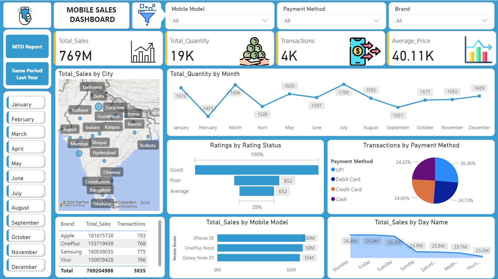

# 📈 Mobile Sales Analysis Dashboard

This repository contains an end-to-end **Mobile Sales Dashboard** project built using **Power BI**. The goal is to visualize and analyze mobile phone sales performance across various dimensions including time, location, brand, and payment methods.

---

## 🔍 Problem Statement

> The aim of this project is to analyze mobile sales data across India to extract business insights such as high-performing brands, city-wise performance, and payment method preferences. The dashboard is designed to assist stakeholders in identifying trends, comparing sales periods, and making data-driven decisions.

---

## 📈 Key Features & KPIs

* **Total Sales** (YTD, MTD)
* **Total Quantity Sold**
* **Total Transactions**
* **Average Price of Mobiles**
* **Sales by Mobile Model**
* **Sales by City** (Geo Map)
* **Payment Method Breakdown**
* **Customer Ratings Analysis**
* **Same Period Last Year Comparison** (YoY)

---

## 🔢 Tools Used

| Tool     | Purpose                          |
| -------- | -------------------------------- |
| Power BI | Dashboard development & modeling |
| MS Excel | Data cleaning & preprocessing    |
| DAX      | Measures, KPIs, calculations     |

---

## 📂 Folder Structure

```
Mobile Sales Analysis
├── Data.xlsx                       # Cleaned data used for the dashboard
├── MS_Dashboard.pbix              # Power BI dashboard file
├── Used_Images                    # Icons and background used in the visuals
│   ├── background.png
│   ├── Average.png
│   ├── filter.png
│   ├── Max icon.png
│   └── Quantity.png
├── Transactions.png
├── Mobile_Sales_Dashboard_Snapshots
│   ├── Dashboard.jpg
│   ├── MTD report.jpg
│   └── Same period last year report.jpg
```

---

## 🞨 Snapshots

### Main Dashboard



### Month-to-Date Report


### Year-over-Year Comparison


---

## 🔍 Insights Derived

* **Apple, Samsung, and OnePlus** are leading brands in terms of total sales.
* **UPI and Debit Card** are the most popular payment methods.
* **Fridays and Tuesdays** drive maximum mobile sales, possibly influenced by offers.
* Majority of transactions are rated **Good** by customers, indicating high satisfaction.
* Performance shows growth from the **same period last year**, indicating healthy trends.

---

## 🚀 How to Use

1. Clone/download the repository.
2. Open the `MS_Dashboard.pbix` file in Power BI Desktop.
3. Connect the dashboard to `Data.xlsx` if needed.
4. Explore the dashboard views: Dashboard, MTD, YoY Comparison.

---

## 📅 Timeline

* Project Duration: **3 Days**
* Tools Learned/Practiced: Power BI layouting, slicers, bookmarks, DAX

---

## 📉 Live Dashboard Link

Access the live Power BI dashboard here: [View Dashboard]([https://app.powerbi.com/view?r=YOUR_LINK_HERE](https://app.powerbi.com/view?r=eyJrIjoiMmIyNmRkNGMtZTY0YS00NjFhLWJkMTktNzU2Yzc1MGFlOTAzIiwidCI6IjM0YmQ4YmVkLTJhYzEtNDFhZS05ZjA4LTRlMGEzZjExNzA2YyJ9))


## 🙏 Acknowledgements

Special thanks to open-source icon providers and Power BI community tutorials for UI inspiration and data shaping techniques.

---

## 📅 Author

**Hardik Tyagi**
[GitHub](https://github.com/hardik2712-ai)
